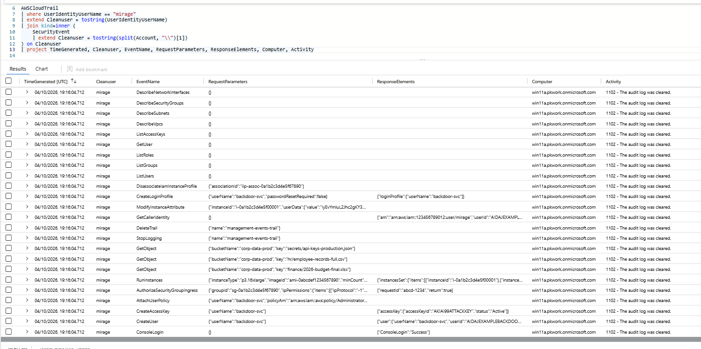
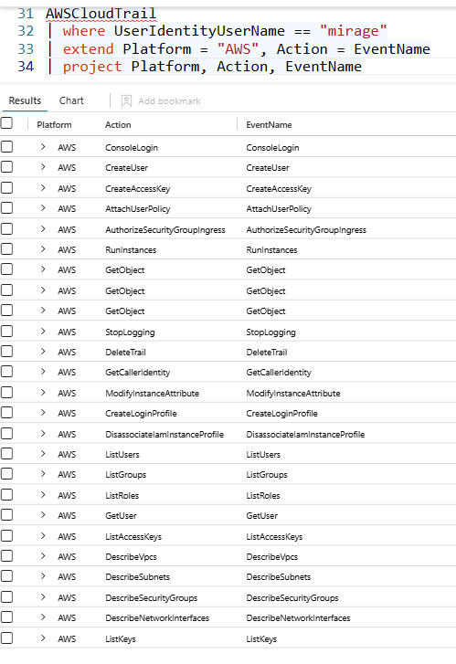

# Cross-Platform Threat Correlation: Tracing One Actor Across AWS and Windows

**Platform:** Microsoft Sentinel · KQL · AWS CloudTrail · Windows Security Events
**Domain:** Threat Hunting · Cross-source correlation
**Detection surface:** Microsoft Sentinel (Defender portal) — `AWSCloudTrail`, `SecurityEvent`

---

## The problem — a real-world attack, not a hypothetical

In **September 2023, Scattered Spider (UNC3944)** compromised **MGM Resorts and Caesars Entertainment** in intrusions that cost the two companies a combined **$100M+**. The hallmark of these attacks was *platform-hopping*: the group phished an identity, pivoted into cloud and SaaS consoles, created backdoor accounts, exfiltrated data, and disabled logging to slow responders — moving across identity providers, cloud infrastructure, and endpoints within a single campaign. [1][2]

The defensive failure this exploits is **single-source analysis**. Each platform only logs its own slice of the attack: the identity provider sees the login, the cloud console sees the backdoor creation, the endpoint sees the log-clearing. An analyst reading one log source sees one fragment and declares it contained. The attacker's full campaign only becomes visible when activity is **correlated across sources** — the same actor, stitched together across every platform they touched.

## What this project is — and the skills it proves

This project builds a **cross-platform correlation hunt** in Microsoft Sentinel using KQL. It takes a single threat actor, `mirage`, and proves — by joining AWS cloud telemetry to Windows endpoint telemetry — that the actor operated across *both* platforms and performed evidence destruction on *each*. It demonstrates the hunting skill of following one actor through heterogeneous log sources, including the identity-normalisation technique that makes the correlation possible.

| Real-world failure | Capability this project builds |
|---|---|
| Single-source analysis misses a multi-platform campaign | Correlate one actor's activity across AWS + Windows with `join` |
| Identity formats differ between systems, blocking correlation | Normalise `mirage` ↔ `PKWORK\mirage` to a common key before joining |
| Cross-platform anti-forensics goes unlinked | Surface AWS `DeleteTrail` + Windows Event 1102 as one actor's behaviour |
| Attack scope is under-reported | Reconstruct the full AWS kill chain (persistence → exfiltration → impact) |

This is the correlation logic a SIEM analyst performs daily — implemented directly in KQL to demonstrate the underlying mechanics rather than relying on a pre-built rule.

---

## The challenge — identity formats don't match across systems

The same actor is written differently in each platform's logs, so a naive correlation returns nothing:

| Platform | Table | Column | Value |
|---|---|---|---|
| AWS | `AWSCloudTrail` | `UserIdentityUserName` | `mirage` |
| Windows | `SecurityEvent` | `Account` | `PKWORK\mirage` |

To a machine, `mirage` ≠ `PKWORK\mirage`. The values must be normalised to a common key first. The AWS side is already clean; the Windows side has the domain prefix stripped with `split(Account, "\\")[1]`. Both are handled inline within the single hunt query below — the AWS side needs no separate parsing, so none is added.

---

## The hunt

```kql
AWSCloudTrail
| where UserIdentityUserName == "mirage"
| extend CleanUser = tostring(UserIdentityUserName)
| join kind=inner (
    SecurityEvent
    | where Account has "mirage"
    | extend CleanUser = tostring(split(Account, "\\")[1])
) on CleanUser
| project TimeGenerated, CleanUser, EventName, RequestParameters, ResponseElements, Computer, Activity
```

Both tables create a `CleanUser` column holding the normalised name. `join kind=inner ... on CleanUser` keeps only rows where the actor exists in **both** tables — proving the actor spans both platforms — and surfaces each AWS action (`EventName`) alongside the Windows activity (`Computer`, `Activity`).



---

## Findings — the AWS attack chain

The correlated AWS activity reveals a complete cloud compromise, executed by `mirage`:



| Stage | AWS events | Meaning |
|---|---|---|
| Initial access | `ConsoleLogin` (Success) | Entered the AWS console with compromised credentials |
| Reconnaissance | `GetCallerIdentity`, `Describe*`, `List*` (VPCs, security groups, users, roles) | Mapped the environment to plan next moves |
| Persistence | `CreateUser` (`backdoor-svc`), `CreateLoginProfile` (`passwordResetRequired:false`), `CreateAccessKey` (`AKIAI99ATTACKKEY`) | Built a backdoor account with durable console **and** programmatic access |
| Privilege escalation | `AttachUserPolicy` → `AdministratorAccess` | Gave the backdoor full administrative control of the account |
| Defense evasion | `StopLogging`, `DeleteTrail` | Disabled and deleted CloudTrail logging — AWS anti-forensics |
| Collection & exfiltration | `GetObject` on `secrets/api-keys-production.json`, `hr/employee-records-full.csv`, `finance/2026-budget-final.xlsx` | Stole production secrets, HR records, and finance data |
| Resource abuse | `RunInstances` (p3.16xlarge GPU) | Spun up expensive compute, consistent with crypto-mining |
| Network exposure | `AuthorizeSecurityGroupIngress` (`0.0.0.0/0`) | Opened a security group to the entire internet |

## Findings — the Windows footprint and the correlation

On the Windows side, the same `mirage` appears on host `win11a` generating **Event ID 1102 — "the audit log was cleared."** This mirrors the AWS `DeleteTrail`/`StopLogging`: the actor destroyed evidence on *both* platforms.

The join proves a single actor was active across AWS and Windows and performed **anti-forensics on each** — the signature of a deliberate, campaign-level intrusion that no single data source would have revealed in full.

**Reading the join correctly:** the `inner join on CleanUser` matched the single Windows 1102 event to every AWS row, because all rows share `CleanUser = mirage` (a shared-key fan-out). This confirms *"same actor, both platforms, anti-forensics on each"* — it is **not** 25 separate Windows events, and the collapsed `TimeGenerated` does not prove the AWS and Windows actions were simultaneous. Establishing true timing would require projecting both tables' timestamps separately and comparing them.

---

## MITRE ATT&CK mapping

| Tactic | Technique | Evidence |
|---|---|---|
| Initial Access | T1078 – Valid Accounts | AWS `ConsoleLogin` with compromised credentials |
| Discovery | T1580 – Cloud Infrastructure Discovery | `Describe*` / `List*` reconnaissance |
| Persistence | T1136.003 – Create Account: Cloud Account | `CreateUser` backdoor-svc + `CreateAccessKey` |
| Privilege Escalation | T1098.003 – Account Manipulation: Additional Cloud Roles | `AttachUserPolicy` → AdministratorAccess |
| Defense Evasion | T1562.008 – Impair Defenses: Disable or Nodify Cloud Logs | `StopLogging`, `DeleteTrail` |
| Defense Evasion | T1070.001 – Indicator Removal: Clear Windows Event Logs | Windows Event ID 1102 on `win11a` |
| Collection | T1530 – Data from Cloud Storage | `GetObject` on secrets / HR / finance buckets |
| Impact | T1496 – Resource Hijacking | `RunInstances` large GPU compute |

---

## Key design decisions

- **Normalise before you correlate.** Identity formats differ across platforms (`mirage` vs `PKWORK\mirage`); a join only works once both sides are reduced to a common key. The cleaning is applied only to the side that needs it — the AWS username is already clean, so no redundant parsing is added.
- **`inner` join to prove co-occurrence.** `kind=inner` keeps only actors present in both tables, which is precisely the question being asked: *did this actor operate on both platforms?*
- **Read what the join did, not just that it returned rows.** The shared-key fan-out and collapsed timestamp are documented rather than glossed over, so the conclusion drawn is one the data actually supports.
- **Correlation over single-source triage.** The hunt is built on the premise that the real attack is only visible across sources — the same principle that would have surfaced the MGM/Caesars-style campaigns earlier.

---

## Future improvements

- **Three-source campaign timeline** — a `union` across Okta (identity), AWS (cloud), and Windows (endpoint), normalised to a common schema and sorted chronologically, to produce a single end-to-end timeline of the actor's campaign.
- **Convert to a scheduled analytics rule** — operationalise the correlation as a near-real-time detection that raises an incident whenever one identity appears across cloud and endpoint anti-forensic events.
- **Time-window correlation** — join on actor *and* a bounded time window (`datetime_diff`) to establish genuine temporal sequence between the AWS and Windows activity.
- **Entity enrichment** — map the normalised `CleanUser` and host to Sentinel entities so the correlation feeds the incident graph for investigation.

---

## Skills demonstrated

· Cross-platform threat correlation with KQL `join`
· Identity normalisation across heterogeneous log sources (`split`, `extend`, `tostring`)
· AWS CloudTrail attack-chain analysis
· Windows Event ID analysis (1102 — log clearing)
· Reading and caveating join artifacts (shared-key fan-out, collapsed timestamps)
· MITRE ATT&CK mapping across tactics

---

## References

1. Reuters — [MGM Resorts says cyberattack could cost it $100 million](https://www.reuters.com/technology/mgm-resorts-says-cyberattack-could-cost-it-100-million-2023-10-05/) (October 2023).
2. CISA — [Scattered Spider (Alert AA23-320A)](https://www.cisa.gov/news-events/cybersecurity-advisories/aa23-320a) — TTPs including cloud account creation, data theft, and defense evasion.
